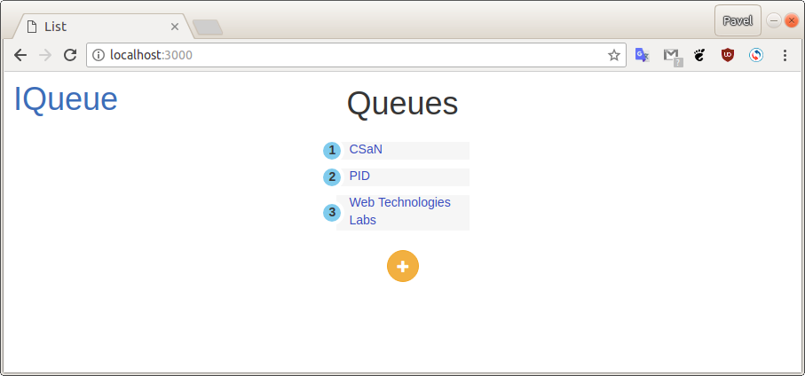
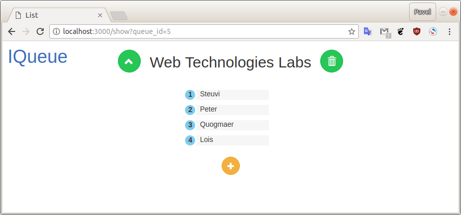
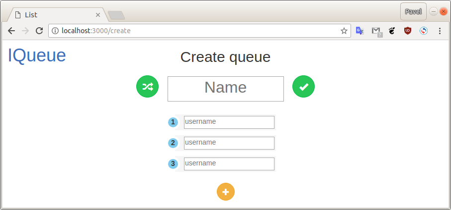

# IQueue
_IQueue_ is a web-app which allows you create, manage and track some user queues.





## Installing
  1. Install [golang](http://golang.org/).
  1. Customize database:
      1. Create PostgreSQL database.
      1. Configure database in `models/db.yml`.
      1. Run `models/init.sql` code for your database.

## Build & Run app
```bash
  $ go build -o iqueue
  $ ./iqueue
```
Last command runs the app on _3000_ port. To run the app on other port execute this command:
```bash
  $ ./iqueue -port <port_number>
```
